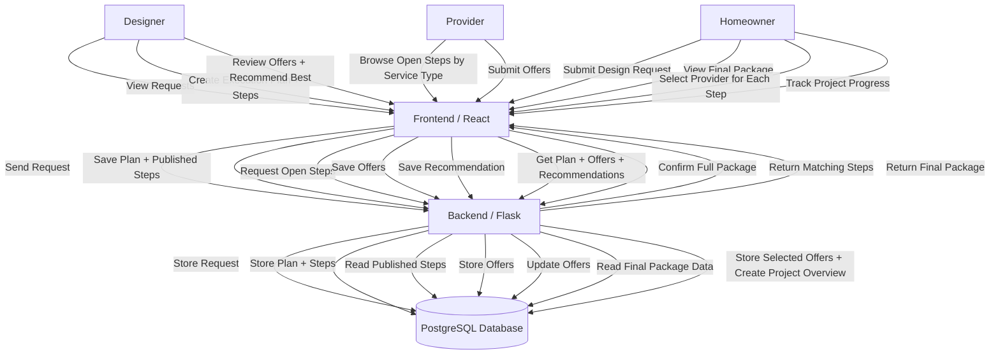
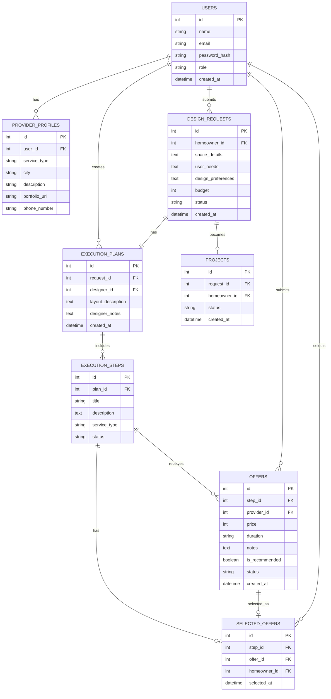
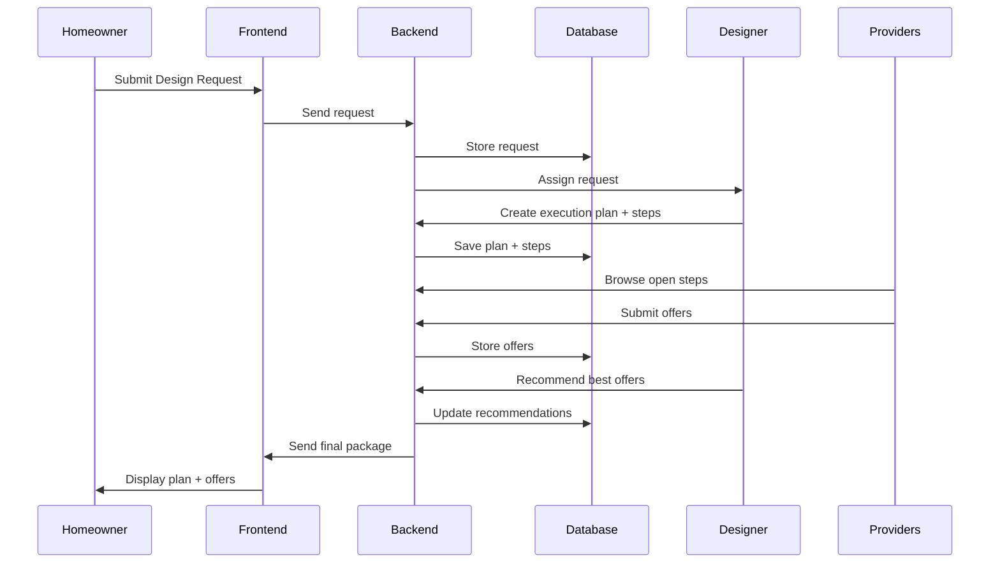
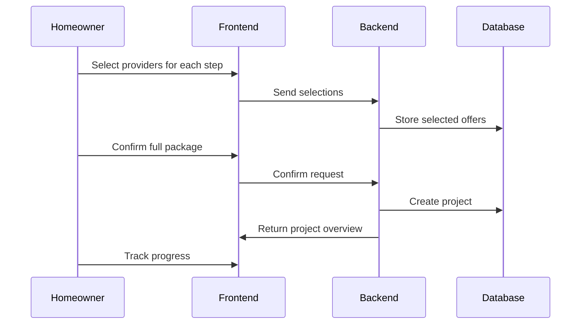

## Project Overview ##

This project introduces a platform that connects clients, interior designers, and execution service providers to transform interior design ideas into real-world implementation through a structured workflow.

Instead of only generating design suggestions, the platform focuses on enabling execution by breaking down designs into actionable steps and connecting them with relevant service providers.

## 1. Problem Statement

### ✔ The Problem
In the current landscape of digital and physical design, several pain points hinder the successful realization of projects:

* **Fragmented Navigation:** Clients struggle to manage and coordinate between multiple service providers and vendors.
* **Execution Gap:** There is a significant lack of knowledge on how to effectively translate a design concept into a finished product.
* **Loss of Creative Oversight:** Designers often lose control and influence over the quality of the final output once the initial design is delivered.
* **Unstructured Workflow:** The transition from design to execution is often fragmented, leading to delays and inconsistent results.

---

## 2. Proposed Solution

Our solution bridges the gap between creative vision and tangible results by transforming the design process into an integrated execution roadmap.

### Key Pillars of the Solution:
* **Design-to-Action Transformation:** Automatically breaking down complex designs into clear, actionable execution steps.
* **Integrated Provider Ecosystem:** Directly connecting each project step with verified service providers and exclusive offers.
* **Expert Recommendations:** Providing curated designer suggestions for each phase to ensure the creative integrity of the project remains intact.
* **Centralized Execution:** Moving from a fragmented process to a structured, all-in-one platform for seamless delivery.
  
## 3. User Types

| User Type | Roles & Responsibilities |
| :--- | :--- |
| **Client** | • Submits comprehensive design requests • Evaluates and selects service providers • Monitors real-time execution progress |
| **Designer** | • Analyzes client requirements and constraints • Develops the strategic execution plan • Deconstructs projects into actionable steps • Recommends the most suitable service offers |
| **Provider** | • Receives specific execution task assignments • Submits competitive service offers • Performs and delivers the actual technical work |

## 4. Core Features

* **1. Design Request**
    * Allows clients to input detailed room specifications, project goals, and budget constraints.

* **2. Execution Plan Creation (Key Feature)**
    * Defines the spatial layout.
    * Deconstructs the design into specific, manageable phases (e.g., Painting, Carpentry, Lighting).

* **3. Offer Collection**
    * Enables service providers to view execution steps and submit competitive offers for each phase.

* **4. Designer Recommendation**
    * Features a review layer where the designer evaluates and tags the best-fit offers to guide the client.

* **5. Final Package (Core Screen)**
    * A consolidated view providing:
        * The full execution roadmap.
        * All received offers.
        * The designer's expert recommendations.

* **6. Selection System**
    * Enables the client to choose a specific provider for every task.
    * **Logic:** The "Confirm" action is only activated once a provider has been assigned to all required steps.

* **7. Project Overview Dashboard**
    * A central hub displaying all execution steps, assigned providers, and the real-time status of each component.

* **8. Execution Start**
    * Facilitates direct contact with selected providers to initiate the physical work.

* **9. Progress Tracking**
    * Real-time tracking of the project lifecycle using clear status indicators:
        * **Pending**
        * **In Progress**
        * **Completed**

## 5 User Stories (MoSCoW Method)

| Category | User Role | User Story |
| :--- | :--- | :--- |
| **Must Have** |  Homeowner | As a homeowner, I want to submit a design request so that I can start my project. |
| |  Homeowner | As a homeowner, I want to receive a clear execution plan (steps) so that I understand how to implement my design. |
| |  Homeowner | As a homeowner, I want to view multiple offers for each step so that I can compare options. |
| |  Homeowner | As a homeowner, I want to select a provider for each step so that I can proceed with execution. |
| |  Homeowner | As a homeowner, I want to track my project and the status of each step. |
| |  Designer | As a designer, I want to convert the request into an execution plan with steps so that the design becomes actionable. |
| |  Designer | As a designer, I want to review and recommend the best offers so that I can guide the client’s decision. |
| |  Provider | As a provider, I want to receive relevant execution steps and submit offers so that I can get work opportunities. |
| **Should Have** |  Designer | As a designer, I want to add notes to each step so that execution matches the design. |
| |  Homeowner | As a homeowner, I want to see which offer is recommended so that I can make a better decision. |
| **Could Have** |  Homeowner | As a homeowner, I want to access provider contact information so that I can start execution quickly. |
| |  Homeowner | As a homeowner, I want to track the progress of each step. |
| **Won't Have (MVP)** | All Users | As a user, I want in-app chat (future feature). |
| | **All Users** | As a user, I want in-app payment (future scope). |
| |  Homeowner | As a homeowner, I want AI-generated designs. |

## 6. Mockups / Wireframes

The following wireframes outline the main user interface screens of the MVP, focusing on the multi-sided marketplace flow.

## 7. Architectural Layers

* **1. Presentation Layer (Frontend)**
    * Built with **React** to provide a responsive and user-friendly interface.
    * Enables users to:
        * Submit design requests.
        * View structured execution plans.
        * Compare multiple service offers.
        * Track real-time project progress.

* **2. Logic Layer (Backend)**
    * Powered by **Flask (Python)**.
    * Handles core business logic, including:
        * Generating and managing execution plans.
        * Processing execution steps (e.g., Painting, Lighting).
        * Collecting and organizing offers from providers.
        * Supporting designer-led recommendations.

* **3. Data Layer (Database)**
    * Uses **PostgreSQL** for robust, structured data storage.
    * Stores and manages:
        * **Users:** Profiles for homeowners, designers, and providers.
        * **Design Requests:** Detailed project inputs.
        * **Execution Plans & Steps:** The actionable roadmap.
        * **Offers:** Submissions from service providers.

**How the System Works**

## 8. Data Flow

The following steps outline the data movement within the platform, from the initial request to execution:

1. **Request Submission**
    * The homeowner submits a design request through a structured form in the **React** frontend, capturing key information such as space details, user needs, design preferences, and budget.
2. **Request Handling**
    * The frontend sends an HTTP request to the **Flask** backend, where the request is validated and stored in the **PostgreSQL** database.
3. **Execution Plan Creation**
    * The designer retrieves the request and creates a comprehensive execution plan, breaking it down into structured, actionable steps.
4. **Step Publication**
    * The execution steps are published and become visible to relevant service providers based on their specific service categories.
5. **Offer Submission**
    * Service providers browse available steps and submit formal offers, including pricing and estimated duration.
6. **Recommendation**
    * The designer reviews the submitted offers and tags the most suitable options with expert recommendations.
7. **Final Package Delivery**
    * The backend compiles the execution plan, all offers, and designer recommendations into a single data package for the frontend.
8. **Client Selection**
    * The homeowner selects a preferred provider for each step and confirms the full package to lock in the plan.
9. **Execution Tracking**
    * The system generates a project overview, allowing the homeowner to monitor the real-time progress and status of each individual step.

##  External Services

###  Current MVP
The current Minimum Viable Product (MVP) is designed to be self-contained for maximum stability:
* **Internal Logic:** All core functionality is handled internally, including request management, execution planning, and offer collection.
* **No External Dependencies:** Does not rely on third-party APIs at this stage to ensure a streamlined core experience.

---

###  Future Scope
As the platform scales, we plan to integrate several external services to enhance the user experience:

* **Payment Gateway Integration:** To facilitate secure in-app transactions between homeowners and service providers.
* **Real-time Communication Tools:** Integration of chat or notification APIs for direct collaboration.
* **AI-Assisted Design Support:** Leveraging AI models to help designers and homeowners generate initial concepts or automate step breakdowns.
* **Location-Based Services (Google Maps API):**
    * Assisting users in finding nearby physical stores.
    * Locating providers and suppliers that offer the specific items required for the execution plan.

## 9. Technical Justification

**Python**

Python was chosen for its simplicity and readability, allowing rapid development and easy implementation of business logic related to execution plans, steps, and offers.

**Flask**

Flask was selected as a lightweight framework to build RESTful APIs that handle:

* Design request processing
* Execution plan creation
* Step management
* Offer submission and retrieval

**PostgreSQL**

PostgreSQL was chosen to manage structured relational data, supporting complex relationships between:

* Users (homeowners, designers, providers)
* Design requests
* Execution plans
* Execution steps
* Offers

## 01. Frontend Components 

The frontend is composed of reusable UI components that support the core execution workflow, from submitting a request to selecting providers and tracking progress.

---

### Main Frontend Components
The frontend is built using **React**, following a modular component-based structure to ensure reusability and a clean, user-friendly interface.

| Component | Description |
| :--- | :--- |
| **App** | The root component that manages the main application flow and global state. |
| **Navbar** | Displays the application name and navigation between main sections. |
| **RequestForm** | The core interface where homeowners submit a structured design request, including space details, preferences, and budget. |
| **ExecutionPlanView** | Displays the execution plan created by the designer, including all steps. |
| **StepCard** | Represents a single execution step (e.g., Painting, Lighting), showing its details. |
| **OffersList** | Displays all offers submitted by providers for a specific step. |
| **OfferCard** | Represents a single offer, including price, duration, and provider details. |
| **RecommendationBadge** | Highlights the designer’s recommended offer. |
| **SelectionPanel** | Allows the homeowner to select one provider for each step and confirm the full package. |
| **ProjectOverview** | Displays all selected providers, steps, and current execution status. |
| **ContactProviderButton** | Allows the user to access provider contact information (e.g., call or WhatsApp). |

## 02. Backend Classes 

The backend is implemented using **Flask** and **Python**. The system is structured around core classes that represent the execution workflow, including requests, execution plans, steps, and offers.

### Main Backend Classes

| Class | Attributes | Methods |
| :--- | :--- | :--- |
| **User** | `id`, `name`, `email`, `password_hash`, `role` (homeowner / designer / provider) | `register()`, `login()` |
| **DesignRequest** | `id`, `user_id`, `space_details`, `preferences`, `budget`, `status` | `create_request()`, `get_request()` |
| **ExecutionPlan** | `id`, `request_id`, `designer_id` | `create_plan()`, `get_plan()` |
| **ExecutionStep** | `id`, `plan_id`, `title`, `description`, `service_type`, `status` | `create_step()`, `publish_step()`, `get_steps()` |
| **Offer** | `id`, `step_id`, `provider_id`, `price`, `duration`, `status` | `submit_offer()`, `get_offers()` |
| **RecommendationService** | (Internal logic) | `recommend_best_offer()` |
| **Project** | `id`, `request_id`, `status` | `create_project()`, `track_progress()` |
| **AuthService** | (Stateless) | `validate_user()`, `hash_password()`, `verify_password()` |

## 03  Database Design

### Main Table :

The system database is structured into the following main tables:

* **users**
* **provider_profiles**
* **design_requests**
* **execution_plans**
* **execution_steps**
* **offers**
* **selected_offers**
* **projects**

## 04. Relationships

The database is structured to reflect the execution workflow, where each entity is connected to support the full project lifecycle from request to execution.

**Relationship Summary**

* **users (1) → (Many) design_requests**
    A homeowner can submit multiple design requests.

* **design_requests (1) → (1) execution_plans**
    Each request is assigned one execution plan created by a designer.

* **users (designer) (1) → (Many) execution_plans**
    A designer can create multiple execution plans.

* **execution_plans (1) → (Many) execution_steps**
    Each execution plan consists of multiple steps.

* **execution_steps (1) → (Many) offers**
    Each step can receive multiple offers from providers.

* **users (provider) (1) → (Many) offers**
    A provider can submit multiple offers for different steps.

* **execution_steps (1) → (1) selected_offers**
    Each step will have one selected offer chosen by the homeowner.

* **design_requests (1) → (1) projects**
    Once the homeowner confirms all selections, a project is created.

## ER Diagram

## 10. Design Rationale

The database structure and system logic are built to support:

* Structured design requests from homeowners
* Execution plan creation by designers
* Step-based task organization
* Offer submission from service providers
* Decision-making through comparison and recommendations
* Project tracking after confirmation

**Sequence Diagram 1 (Request → Plan → Offers)**

----

**Sequence Diagram 2 (Selection → Project → Execution)**

## 11. API Specifications 

**External APIs**

The current MVP does not rely on external APIs.
All functionality is handled internally, including request management, execution planning, and offer collection.

**Internal APIs**

The following endpoints define the core system functionality supporting the execution workflow.

API Endpoints

| Endpoint | Method | Description | Main Input | Main Output |
| :--- | :--- | :--- | :--- | :--- |
| /requests | POST | Create design request | space details, needs, budget | request_id |
| /plans | POST | Create execution plan | request_id, layout, notes | plan_id |
| /steps | POST | Add execution step | plan_id, service_type | step_id |
| /offers | POST | Submit provider offer | step_id, price, duration | offer_id |
| /select-offer | POST | Select provider offer | step_id, offer_id | confirmation |
| /projects/{id} | GET | Track project | project_id | project status |

 
 ## 12. SCM & QA Strategies
The project uses Git and GitHub for version control and collaboration. Development is carried out using Visual Studio Code as the primary development environment. A structured branching strategy is followed to ensure organized development and code stability.

### Development & Version Control

#### Branching Strategy
* **main:** Contains stable, production-ready code.
* **develop:** Serves as the primary integration branch for ongoing development.
* **feature branches:** Dedicated branches created for specific tasks (e.g., feature/design-form, feature/api-endpoints).

#### Workflow
* Developers create a unique feature branch for every assigned task.
* Changes are committed regularly using clear and descriptive commit messages.
* Pull Requests (PRs) are opened to merge completed features into the develop branch.
* Peer code reviews are conducted to ensure quality and consistency before merging.
* Once the develop branch is verified as stable, it is merged into the main branch.

#### Development Tools
* **Visual Studio Code:** The primary IDE used for coding, linting, and debugging.
* **Swagger:** Utilized for comprehensive API documentation and interactive testing.

## Quality Assurance (QA) Testing Strategy

**Manual Testing**

* Validating the design request form to ensure accurate input handling
* Verifying execution plan creation and step structure
* Testing offer submission and selection flow
* Ensuring the full workflow from request to project confirmation works correctly
* Testing authentication flows (login / signup)

**API Testing**

* Using Swagger to test all API endpoints
* Validating request and response formats (JSON)
* Ensuring correct HTTP status codes are returned
* Testing endpoints for requests, plans, steps, offers, and projects

**Test Scenarios**

* **Valid Input**:
    Ensures the system correctly processes requests, plans, and offers
* **Invalid Input**:
    Verifies proper error handling and validation messages
* **Offer Selection Flow**:
    Ensures users can select providers for each step correctly
* **Project Confirmation Flow**:
    Verifies that a project is created after confirming selections
* **Authentication Flow**:
    Ensures only authenticated users can perform protected actions

 **Deployment Plan**

* **Local Development**:
    The system is developed and tested locally using Flask
* **Database Setup**:
    PostgreSQL is used to manage relational data
* **Future Deployment**:
    The system can be deployed to a cloud environment (e.g., AWS) for scalability and public access

